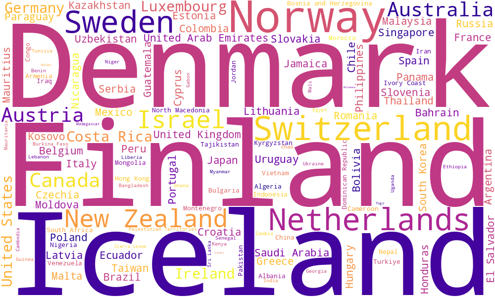

<h1 style="color:#C71585;">World Happiness Analytics (2015–2024)</h1>

This project explores World Happiness Report data from 2015 to 2024 to understand how health and family support influence national happiness. It covers data cleaning, visual analysis in Tableau, and statistical testing. A predictive model is also built to explore future trends.The project features an interactive Streamlit app with fun little games based on real happiness score data, making insights more engaging and easy to explore.

<h2 style="color:#C71585;">Column Descriptions</h3>

  
Click to view Column descriptions

| **Column Name**                 | **Explanation**                                                                |
| ------------------------------- | ------------------------------------------------------------------------------ |
| `Country`                       | Name of the country                                                            |
| `Happiness Rank`                | Country’s position in the global happiness ranking for that year               |
| `Happiness Score`               | Overall happiness score based on survey data and contributing factors          |
| `Economy`                       | Contribution of GDP per capita to the happiness score                          |
| `Family`                        | Level of social support and family connections (based on survey responses)     |
| `Healthy life expectancy`       | Expected number of years a person can live in good health, starting from birth |
| `Freedom to make life choices`  | Level of freedom individuals feel in making life decisions                     |
| `Perceptions of corruption`     | Public perception of corruption in government and business                     |
| `Generosity`                    | Willingness to donate to others, based on survey data and donations            |
| `Continent`                     | Continent the country belongs to (added for regional analysis)                 |
| `Year`                          | Year the data was collected (2015–2024)                                        |
| `Happiness Rank (Cleaned Data)` | Adjusted rank after cleaning and standardizing the dataset                     |

<h2 style="color:#C71585;">Project Structure and Development Overview</h3>

This project is organized into **5 Jupyter notebooks**, each addressing a distinct phase of happiness analysis:

  
<strong>01_etl_pipeline</strong>

This notebook handles the extraction, transformation, and loading (ETL) of happiness report data from 2015 to 2024. It combines and cleans data across 10 years, ensuring consistency and completeness. A final dataset of 131 countries with complete records is created by dropping countries with missing data. Additional feature engineering is performed to prepare the data for further analysis.

  
<strong>02_descriptive_analysis</strong>

This notebook provides an overview of global happiness trends using descriptive analysis techniques. It includes key visualizations such as scatter plots, area charts, heatmaps, and bar charts. These explore relationships between health, happiness, and other contributing factors. The analysis also highlights differences in happiness patterns across continents and over time.

  
<strong>03_hypothesis_testing</strong>

This notebook tests specific hypotheses to determine which factors significantly affect happiness. Statistical tests include the Kruskal-Wallis and Mann-Whitney U tests. Variables like family support, life expectancy, generosity, and continent are analyzed. The results provide evidence-based insights into which factors show significant differences in happiness levels.

  
<strong>04_diagnostic_analysis</strong>

This notebook explores why India ranks lower in happiness compared to top countries. It shows that India scores less in income, health, and social support—key factors linked to happiness. It also tracks how India’s happiness score dropped from 2015 to 2020 and only partly recovered by 2024. These insights help identify what India needs to improve for better well-being.

  
<strong>05_predictive_analysis</strong>

This notebook builds a model to predict future happiness scores of countries using data from 2015 to 2024. It includes data cleaning, creating lag features to capture past trends, and training models like Linear Regression and Random Forest. The notebook evaluates model performance and saves the Linear Regression model for future use. This helps forecast happiness trends and supports informed decision-making.

## Branches

This project is developed using feature branches for modular and organized development. The main branches are:

- `main` — The main production branch containing the stable, integrated code.
- `happyblazer-etl-pipeline` — Handles data extraction, transformation, and loading (ETL) of the happiness report data.
- `happyblazer-descriptive-analysis` — Contains notebooks and scripts for descriptive and exploratory data analysis.
- `happyblazer-hypothesis-testing` — Dedicated to statistical testing and hypothesis validation.
- `happyblazer-diagnostic-analysis` — Focuses on diagnostic analysis, including case studies like India's happiness trends.
- `happyblazer-predictive--analysis` — Contains the predictive modeling work, including data preprocessing, lag feature creation, model training, evaluation, and saving the Linear Regression model.

<h2 style="color:#C71585;">Key Questions Addressed</h3>

1. How does health (life expectancy) relate to world happiness?

There is a strong positive correlation between healthy life expectancy and happiness scores across countries from 2015 to 2024. Countries with higher life expectancy generally report higher happiness levels. European nations tend to show both high life expectancy and happiness, while many African countries fall into the lower ranges. This suggests that improving health outcomes could be an effective way to increase national well-being.

2. How has world happiness changed over time (2015–2024)?

Nordic countries like Finland, Denmark, Norway, and Sweden consistently rank among the happiest globally with stable scores. Their resilience reflects strong social systems and quality of life, even during crises such as the COVID-19 pandemic. Conversely, countries like Afghanistan and many Sub-Saharan African nations remain at the lowest happiness levels. India’s happiness scores fluctuate but generally stay in the lower-middle range, indicating ongoing challenges.

3. Which factors most strongly influence world happiness?

Family and social connections show the strongest positive correlation with happiness at 0.82, highlighting their importance. Economic prosperity (GDP per capita) closely follows with a correlation of 0.81. Healthy life expectancy is also a major contributor with a correlation of 0.79. Perceptions of corruption negatively impact happiness, while generosity has only a weak positive correlation.

4. Do certain factors lead to statistically significant differences in world happiness?

Statistical tests reveal that family support and life expectancy affect happiness levels. These factors show clear differences in average happiness scores between groups. Generosity, despite being positively viewed, does not have a significant statistical impact on happiness. This underscores the key role of social and health factors in well-being.

5. If India is a happy place, why does it rank lower than top countries like Finland?

India is a happy place in many ways — people often find joy in family, traditions, festivals, and strong community bonds. However, the World Happiness Report measures happiness using factors like income, healthy life expectancy, social support, and perceived freedom. Compared to top-ranked countries such as Finland and Denmark, India scores lower in these areas. In addition, India’s large population combined with deep economic and social inequality affects access to basic services and opportunities, which lowers the average national well-being score. So while many individuals may feel personally happy, the overall ranking reflects broader structural challenges that need to be addressed.

6. How has India’s happiness changed since 2015?

India’s happiness score declined from 4.5 in 2015 to around 3.5 in 2020, with the sharpest drop during the COVID-19 pandemic. By 2024, it had slightly recovered to about 4.2 but still remains below pre-2018 levels. This downward trend highlights how large-scale socioeconomic challenges, such as inequality, unemployment, and healthcare access, continue to affect the nation’s overall happiness.

<h2 style="color:#C71585;">Tools Used</h3>

- **Python** for data processing and modeling
- **Pandas** and **NumPy** for data cleaning, manipulation, and numerical operations
- **Matplotlib**, **Seaborn**, and **Plotly** for data visualization and exploratory data analysis
- **OneHotEncoder** from scikit-learn for encoding categorical variables
- **Scikit-learn** for building and evaluating predictive models (Linear Regression, Random Forest)
- **StandardScaler** for feature scaling
- **SharpWalk** to guide selection between parametric and non-parametric statistical tests for hypothesis analysis
- **Joblib** for saving/loading models
- **Streamlit** for building the interactive web app interface
- **Design Thinking** framework to guide user-centered app design, especially for a young persona (Alfie)
- **A/B Testing** to compare minimal and rich UI versions of the app for optimal engagement

<h2 style="color:#C71585;">Analysis Used</h3>

- **Exploratory Data Analysis (EDA)** with visualizations
- **Feature Engineering** including lag features to capture temporal trends
- **Predictive Modeling** using regression and ensemble methods
- **Model Evaluation** using metrics like R² Score and Mean Squared Error (MSE)
- **Hypothesis Testing** decision support guided by SharpWalk
- **User Experience Testing** using A/B testing structure to gather feedback and iterate based on user behavior

This combination of tools, analytical methods, and design strategies supports a well-rounded exploration and prediction of happiness scores from 2015 to 2024 while creating a playful, educational experience for young users like Alfie.

<h2 style="color:#C71585;">Tableau Dashboard</h3>

View the interactive dashboard: [Click here](https://public.tableau.com/app/profile/angel.jayakumar/viz/Book2_17521895743850/Whatmakenationshappy)

<h2 style="color:#C71585;">Word Cloud Visualization</h3>

The word cloud image displayed above was generated using the Python `WordCloud` library. It visually represents countries sized by their happiness rank, where countries with higher happiness appear larger. This visualization helps to quickly identify and compare happiness levels across different countries.

<h2 style="color:#C71585;">Data Source and Credits</h3>

This project uses data from two Kaggle datasets:

- [World Happiness Report 2015–2019](https://www.kaggle.com/datasets/unsdsn/world-happiness?select=2019.csv)
- [World Happiness Report 2020–2024](https://www.kaggle.com/datasets/samithsachidanandan/world-happiness-report-2020-2024)

The original data is based on the **Gallup World Poll**, which surveys over 160 countries and includes key well-being indicators such as happiness score, GDP per capita, social support, healthy life expectancy, and more. All 10 CSV files were cleaned and merged to create a unified dataset for analysis covering the years 2015 to 2024.

## World Cup of Happiness – Streamlit Game App

### 🧒 User Persona: Alfie – The Creative Builder

Age: 9 years old
Interests: Maths, Roblox, Minecraft, LEGO, Football
Goal: To understand how today’s choices affect happiness now and in the future
Motivation: Learning through play and interactive challenges that connect to his favorite games

Alfie’s curiosity and creativity shaped the core of this project. The app is tailored to help young learners engage with global data in ways that are playful, interactive, and meaningful.

### Design Thinking Approach

The development of World Cup of Happiness followed the Design Thinking process to ensure it was engaging, educational, and suited for children like Alfie:

#### Empathize:

Observed how children learn best—through visuals, play, games, and interactive feedback.

#### Define:

"How can we help kids explore what makes people happy in different countries in a way that's fun, visual, and educational?"

#### Ideate:

Brainstormed features such as flag games, happiness score guessing, feedback animations, and playful UX.

#### Prototype:

Developed two core mini-games with a simple user interface, including loading real-world data.

#### Test:

Informal testing with kids and parents was used to check engagement, usability, and comprehension.

World Cup of Happiness is a fun and educational game app designed for children to explore global happiness data through playful interaction. Originally inspired by Alfie’s curiosity, it serves as the main app in the Happiness & Well-Being project.

The app helps young users learn about geography, data interpretation, and emotional well-being using real data from the World Happiness Report.

### Key Features

Guess the Happiness Score:
Players are shown a country and guess its happiness score. After submitting their guess, the real score is revealed (based on official World Happiness Report data), offering fun insights and learning.

Guess the Flag Game:
Players match flags to countries, reinforcing global geography and cultural awareness in an engaging way.

If you'd like to run the app yourself, it can be hosted locally.  
(Screenshot provided below)

  
  
  

## Future Development

Happiness Predictor App-An interactive Streamlit app that lets users experiment with factors like Economy, Health, Family, Freedom, and Generosity to see how they affect happiness scores—powered by a trained Linear Regression model (R² = 0.58).

A/B Testing-To ensure the best user experience, two UI versions will be developed and tested:Version A (Minimal UI): Clean layout with basic sliders and results and Version B (Rich UI): Interactive charts, emoji feedback, and visual storytelling.User feedback will be collected through informal testing with parents and children to refine engagement and clarity.

## Data Ethics and Considerations

The data used is publicly available and does not contain any personal or private information.Happiness scores reflect survey responses and may be influenced by cultural differences.

## Project Motivation

I chose this project because I love to travel and have always been curious about how people live and feel in different countries around the world. Understanding what makes people happy in various cultures and regions fascinates me. This project allows me to combine my passion for global exploration with data science to uncover insights about well-being and happiness worldwide.

## Challenges Faced

I had some problems with Python package versions not being compatible on my Mac. This caused errors when running the code. I fixed it by managing package versions carefully using virtual environments.

### Acknowledgements

Huge thanks to the Kaggle community for the awesome data that made this project possible. Also,thanks to ChatGPT and Claude AI for giving me a hand when I got stuck or needed ideas. And thanks to everyone who cheered me on along the way!
